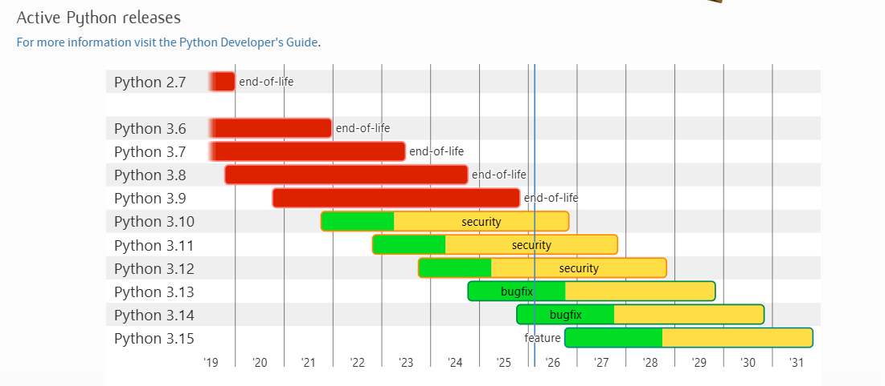

知识冰山

## 分析工具

python是开源解释语言，不断更新版本，官网可查看其各种版本的维护状态,。

更通用，功能更多，下面都以python语言学习

## fisher
统计之王fisher

### GLM
为什么GLM(generalized linear model)比普通的Linear models低了两层？
区分general linear model和generalized linear model:

