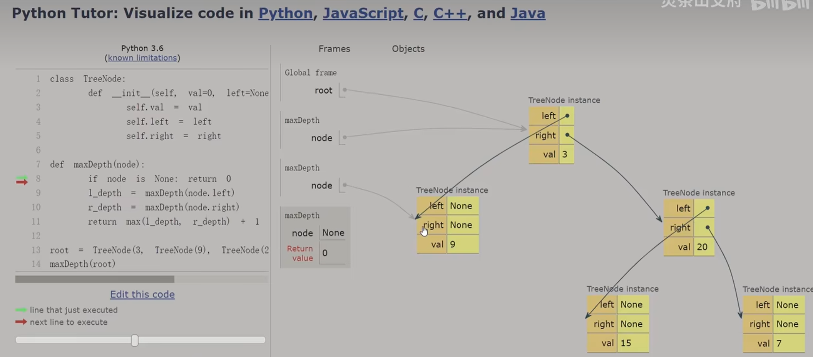

写此系列博客的榜样来自：[leetcode cookbook](https://books.halfrost.com/leetcode/)

# 递归
1. 如何思考二叉树相关问题？
- 不要一开始就陷入细节，而是思考整棵树与其左右子树的关系。
2. 为什么需要使用递归？
- 子问题和原问题是相似的，他们执行的代码也是相同的（类比循环），但是子问题需要把计算结果返回给上一级，这更适合用递归实现。
3. 为什么这样写就一定能算出正确答案？
- 由于子问题的规模比原问题小，不断“递”下去，总会有个尽头，即递归的边界条件 ( base case )，直接返回它的答案“归”；
- 类似于数学归纳法（多米诺骨牌），n=1时类似边界条件；n=m时类似往后任意一个节点
4. 计算机是怎么执行递归的？
- 当程序执行“递”动作时，计算机使用栈保存这个发出“递”动作的对象，程序不断“递”，计算机不断压栈，直到边界时，程序发生“归”动作，正好将执行的答案“归”给栈顶元素，随后程序不断“归”，计算机不断出栈，直到返回原问题的答案，栈空。

5. 另一种递归思路
- 维护全局变量，使用二叉树遍历函数，不断更新全局变量最大值。

